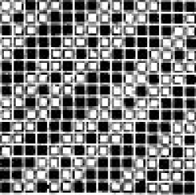
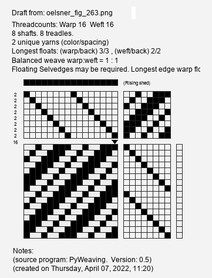
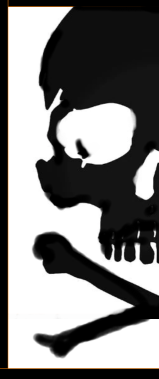
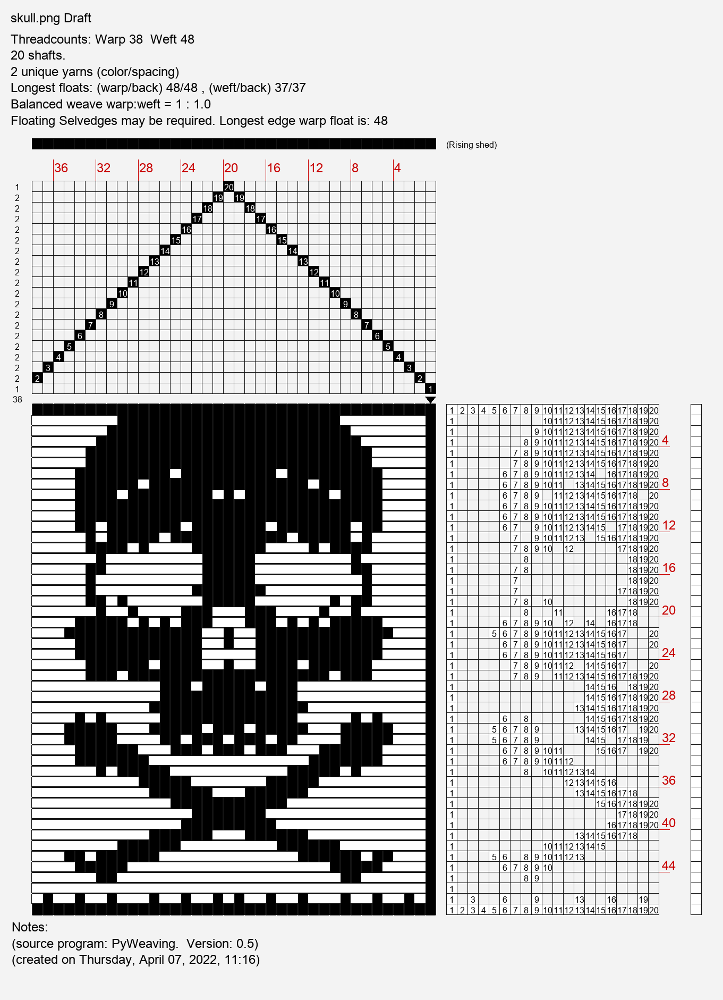

Command Line Usage
==================

PyWeaving includes a command-line utility that can be used for basic tasks.
This section will show some examples. You can also see the utility itself for more info::

    $ pyweaving -h

Will print this Usage text::

	usage: pyweaving [-h] {render,convert,thread,weave,tieup,stats,tartan,twill,drawdown,image} ...
	Weaving utilities for wif files.
	positional arguments:
	  {render,convert,thread,weave,tieup,stats,tartan,twill,drawdown,image}
							Sub-command help
		render              Render a draft.
		convert             Convert between draft file types.
		thread              Show threading instructions for a draft.
		weave               Show weaving instructions for a draft.
		tieup               Show tie-up instructions for a draft.
		stats               Print stats for a draft.
		tartan              Create a wif from the tartan generator (and optionally render).
		twill               Create a wif from the twill generator (and optionally render).
		drawdown            Create a wif from a supplied image of a drawdown (and optionally render).
		image               Create a wif from a supplied image (and optionally render).

Help is available for each of the subcommands.
E.g. for render ::

	$ pyweaving render -h
	
::

	usage: pyweaving render [-h] [--liftplan] [--floats FLOATS] [--style STYLE]
							[--structure]
							infile [outfile]

	positional arguments:
	  infile           The wif file to load.
	  outfile          The resulting image filename or use ``autopng`` or ``autosvg`` for a safely autonamed image file

	optional arguments:
	  -h, --help       show this help message and exit
	  --liftplan       Show draft as a liftplan even if defined with a Tieup.
	  --floats FLOATS  Highlight floats above this size.
	  --style STYLE    Use a named style from styles.json in ~/.pyweaving directory.
	  --structure      Warp is Black, Weft is white.

Draft Rendering
---------------

Here are a number of examples using the **render** option.

**Render Examples:**

Render example.wif from the current directory. The resulting draft pops up in your system's image viewer::

    $ pyweaving render example.wif

Same but save the rendered draft image to out.png::
	
    $ pyweaving render example.wif out.png

Same but will save the image to a uniquely named image based on the filename::

    $ pyweaving render example.wif autopng
	The first time the resulting file will be example.png. Then example-01.png, and so on.
	The filename will be unique so if there is already an example-01.png then the new file will
	be called example-02.png. No image files will be overwritten.

Same but will save the draft in svg format. For quality vector printing or viewing in a browser::

    $ pyweaving render example.wif autosvg

Save as a draft in png format but use the style called *shading* defined in the styles.json file in your home directory::

    $ pyweaving render example.wif autopng --style shaded
	If there is no style with that name then help will be displayed in the form of
	styles found that partially match the supplied style name.
	Choose from one of these for successful output.

This example highlights all floats longer than 5 threads long::

    $ pyweaving render example.wif autopng --floats 5
	
Render showing the structure. (This overrides the warp and weft colors with black and white to emphasise the fabric structure)::

    $ pyweaving render example.wif autopng --structure

Render the draft in liftplan format regardless of how it was defined::

    $ pyweaving render example.wif autopng --liftplan

Tartan Generator
----------------

pyweaving has a list of known tartans which you can access by name,
or you can use a sett description to define a tartan manually.
The ``render`` option only writes png files. Render the resulting wif file in a subsequent command to get svg options.

Usage for tartan::

	$ pyweaving tartan -h

::

	usage: pyweaving tartan [-h] [--direction DIRECTION] [--repeats REPEATS] [--render]
							[--renderfile RENDERFILE] [--style STYLE]
							sett outfile

	positional arguments:
	  sett                  The Tartan pattern "B46,G3,Y1,G4" or a tartan name.
	  outfile               Save to this file or "auto"(default) for an autoname in current directory.

	optional arguments:
	  -h, --help              show this help message and exit
	  --direction DIRECTION   Twill direction S, Z(default).
	  --repeats REPEATS       How many times to repeat the sett.
	  --render                Also render to file.
	  --renderfile RENDERFILE filename or "auto"(default) for an autoname.
	  --style STYLE           Use a named style from styles.json in ~/.pyweaving directory.

**Tartan examples:**

Show a list of known tartans with *kellar* in the name::

    $ pyweaving tartan kellar auto
	Found 4 tartans. Choose the one you want to see.
	  MacKellar -STS
	  MacKellar(2) -STS
	  MacKellar, dress -STS
	  MacKellar, dress(2) -STS
	Tartan not found

Generate the tartan and save the wif into the specified file::

    $ pyweaving tartan "MacKellar -STS" mytartan.wif

Generate the Tartan and name it automatically to a similarly named wif file::

    $ pyweaving tartan "MacKellar -STS" auto
	The new file wil be named 'gen_tartan_MacKellar_-STS.wif'
	Autonaming will ensure that the file is not overwritten by adding a numbered suffix if required.

Same but create a tartan with only 1 repeat The default is 2::

    $ pyweaving tartan "MacKellar -STS" --repeats 1 auto

Same but use an S direction twill instead of the default Z twist::

    $ pyweaving tartan "MacKellar -STS" --direction S auto

Generate the wif and also render the draft to an automatically named png image file::

    $ pyweaving tartan "MacKellar -STS" auto --render

Generate the wif from a Sett definition directly::

    $ pyweaving tartan "B24_W4_B32_R4_K32_G24_W2" auto
	Will use that sett to build the tartan.

E.g. to produce kincardine_tweed::

    $ pyweaving tartan "B/4 DY15 R1 DY/30 . G/4 O15 R1 O/30" auto

Tartan Sett definitions and colors are those defined by the `Scottist Tartans Register <https://www.tartanregister.gov.uk/index>`_
Examine the format here: `Guidance <https://www.tartanregister.gov.uk/threadcount>`_

Twill Generator
----------------

pyweaving can generate a variety of twills using a twill description.
The ``render`` option only writes png files. Render the resulting wif file in a subsequent command to get svg options.

Usage for twill::

	$ pyweaving twill -h

::

	usage: pyweaving twill [-h] [--repeats REPEATS] [--render] [--renderfile RENDERFILE]
						   [--style STYLE]
						   shape outfile

	positional arguments:
	  shape                 Twill pairs separated by spaces. E.g. 2/2 or "1/2 2/1S"
	  outfile               Save to this file or "auto"(default) for an autoname in current
							directory.

	optional arguments:
	  -h, --help            show this help message and exit
	  --repeats REPEATS     How many times to repeat the twill.
	  --render              Also render to file. Add auto to get an autonamed imagefile.
	  --renderfile RENDERFILE
							filename or "auto"(default) for an autoname.
	  --style STYLE         Use a named style from styles.json in ~/.pyweaving directory.

**Twill examples:**

Generate a 2/2 Z twill with 2 repeats(default) and save the wif into the specified file::

    $ pyweaving twill 2/2 mytwill.wif
	Z directon and 2 repeats is the default, if not specified.

Same but autoname the wif file by using the description of the twill::

    $ pyweaving twill 2/2 auto
	Generates a file called 'gen_twill_22.wif'

Same but also render the draft to a suitably named image file::

    $ pyweaving twill 2/2 auto --render

Same but repeat the basic twill 3 times instead of the default 2::

    $ pyweaving twill 2/2 --repeats 3 auto --render
	The order of the arguments can be varied:
	$ pyweaving twill 2/2 auto --repeats 3 --render
	$ pyweaving twill --repeats 3 --render 2/2 auto

Same but do a more complex multipart twill and in the S direction::

    $ pyweaving twill "1/2 2/1 1/3S" auto --render
	The twill shape is enclosed in quotes because there are spaces within it.

Also change the rendered style to minimal::

    $ pyweaving twill "1/2 2/1 1/3S" auto --render --style minimal

Drawdown generator
-------------------

pyweaving can attempt to create a draft from the image of a drawdown. There are some limitations.
The image needs to be composed of white and black squares. (However as long as black is evident,
White will be inferred from the other colors, or shades of grey.)
The internal black and white squares also need to be square.

The user defines how many squares across is in the image and the number of weft threads is inferred from
the image size and the assumption of squareness of the color squares.
However there is some flexibility. If the height is also known then use the WxH option when defining the shafts.

You can check where the samples are being made by looking for a new file ending in 'sampleref' in the directory.
The red dot shows where the samples are being made.
Looking at this image and editing it in an image editing program can help you to get a good fit.
Perhaps by removing a line of pixels from one edge so the red dots lie in the center of each square in the drawdown.

The image can be jpg,png,gif etc.

The core option will create a repeatable shaft and ignore extra squares in the repeat parts of the drawdown image if they are there.
It will also optimise the draft for the minimum number of warps and wefts needed.

Usage for drawdown::

	$ pyweaving drawdown -h

::

	usage: pyweaving drawdown [-h] [--shafts SHAFTS] [--core] [--render]
							  [--renderfile RENDERFILE] [--style STYLE]
							  imagefile outfile

	positional arguments:
	  imagefile             The image file of the drawdown.
	  outfile               Save to this file or "auto"(default) for an autoname in
							current directory.

	optional arguments:
	  -h, --help            show this help message and exit
	  --shafts SHAFTS       How many shafts to use. E.g. 8, or 8x16
	  --core                Reduce to non-repeating core draft
	  --render              Also render to file. Add auto to get an autonamed imagefile.
	  --renderfile RENDERFILE
							filename or "auto"(default) for an autoname.
	  --style STYLE         Use a named style from styles.json in ~/.pyweaving directory.

**Drawdown examples:**

Generate a drawdown from a screenshot from a draft patterns book::

    $pyweaving drawdown oelsner_fig_263.png --shafts 16 --render auto
	Wrote wif: gen_draft_oelsner_fig_263.wif
	Wrote image: gen_draft_oelsner_fig_263.png
	There is also ``sampleref`` image showing where samples were taken from.

Note that we could have used the alternate shaft description if our squares were not exactly square.
(Check the sampleref file to see if required)::

	$pyweaving drawdown oelsner_fig_263.png --shafts 16x16 --render auto
	
The screenshot:

The resulting  8 shaft draft showing 2 repeats:

Image generator
-------------------

pyweaving can take a pictorial image and generate a draft with that image in it (as a point draw mirrored drawdown).

You typically need to specify a large number of shafts to get a recognisable image. Simple images are best.
The images can be in color. The result will be a dithered black and white representation.

Usage for image::

	$ pyweaving image -h

::

	usage: pyweaving image [-h] [--shafts SHAFTS] [--repeats REPEATS] [--render]
						   [--renderfile RENDERFILE] [--style STYLE]
						   imagefile outfile

	positional arguments:
	  imagefile             The image file to load.
	  outfile               Save to this file or "auto"(default) for an autoname in
							current directory.

	optional arguments:
	  -h, --help            show this help message and exit
	  --shafts SHAFTS       How many shafts to use. E.g. 40
	  --repeats REPEATS     How many repeats to create
	  --render              Also render to file. Add auto to get an autonamed imagefile.
	  --renderfile RENDERFILE
							filename or "auto"(default) for an autoname.
	  --style STYLE         Use a named style from styles.json in ~/.pyweaving directory.

**Image examples:**

Turn a simple black and white image into a draft with a single repeat.
Use 20 shafts and render the result::

    $pyweaving image gen-skull-03.png --shafts 20 --repeats 1 --render auto
	Creates a wif: gen_image_gen-skull-03-02.wif
	and image: gen_image_gen-skull-03-01.png

Here is the original image file:

and the resulting rendered wif file:

Colors generator
-------------------

pyweaving can extract the most common colors in an image. It does this by clustering all the image's colors together then finding the center of each cluster.
Specify the image and number of colors you are looking for, and it will generate a new image containing a swatch of that many colors.

The command reports the number of colors found and their hex and rgb values.
The swatch image file will have a unique name and not overwrite an existing file.

There is a certain randomness in initial choices so you will get a slight variation in colors on several attempts.
We suggest you repeat this operation at least twice and see the resulting images.
Note that if you ask for 4 colors but the image only contains three, then you will get an error.
To succeed run the command again asking for less colors.

Note that it is also possible to ask for 6 colors in an image which only has 3 distinct clusters of colors.
In this case you will get only 3 reported to you. It will take longer to search for more colors.

Usage for colors::

	$ pyweaving colors -h

::

	usage: pyweaving colors [-h] [--count COUNT] [--size SIZE] imagefile

	positional arguments:
	  imagefile      The image file to examine.

	optional arguments:
	  -h, --help     show this help message and exit
	  --count COUNT  How many colors to find.
	  --size SIZE    Size(pixels) of each color square in the resulting swatch image.

**Colors examples:**

Find the most common colors in an image. Report back and create a swatch image file.
The default number of colors to look for is 6. The default swatch height is 20 pixels::

    $pyweaving colors sample_image.jpg
	Results in the following output:
	Found 6 colors in sample_image.jpg
	- the random nature of initial sampling can lead to slightly different results each time
	#03260d (3, 38, 13)
	#15361b (21, 54, 27)
	#446445 (68, 100, 69)
	#a56b42 (165, 107, 66)
	#e8b78f (232, 183, 143)
	#d7d8d4 (215, 216, 212)
	Wrote image: sample_image-colorrefx6.png

Find the 5 most common colors and make the swatch image 10 pixels high::

    $pyweaving colors sample_image.jpg --count 5 --size 10

Here is an example swatch output file (6 colors):

Instructions
------------

These instructions are interactive, and intend to walk you step-by-step through
various processes, providing useful statistics and progress saving along the
way.

Show instructions for threading a draft::

    $ pyweaving thread example.wif

Show instructions for weaving::

    $ pyweaving weave example.wif --liftplan --repeats 50

File Conversion
---------------

pyweaving uses the wif file as its primary file format.
There is a json variant which may be used in the future.
At the moment there is little use for this outide of development.

You can use it to make a large wif file shorter if the original wif is not optimised.

**Convert examples:**

Convert between WIF and JSON::

    $ pyweaving convert example.wif example.json

Specifying a wif file for input and output will save using some optimisations.
This **may** make your wif file a bit smaller::

	$pyweaving convert large_file.wif hopefully_smaller_file.wif