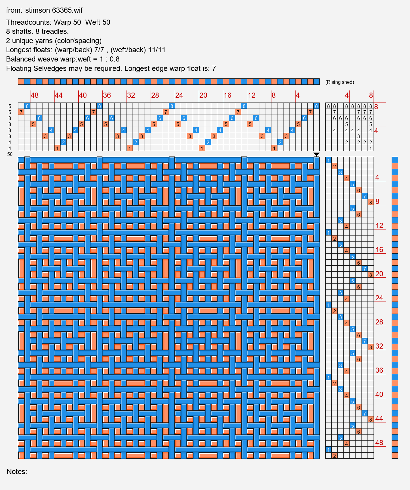
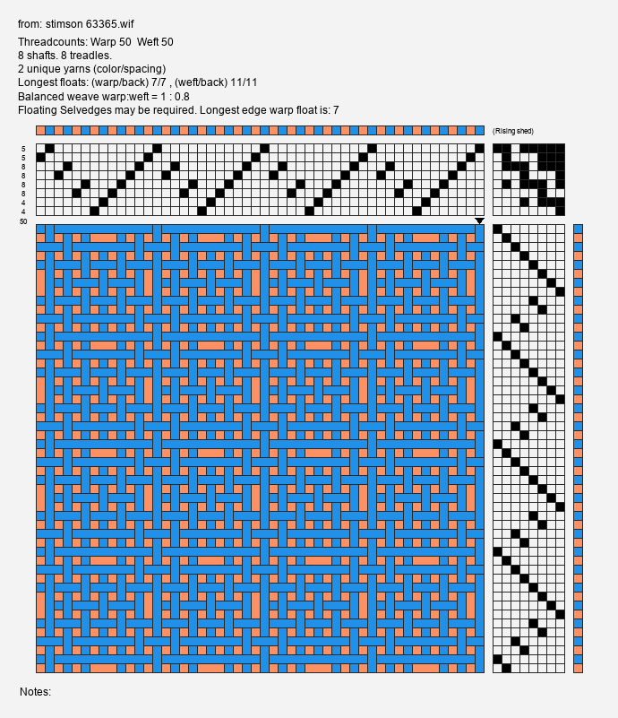
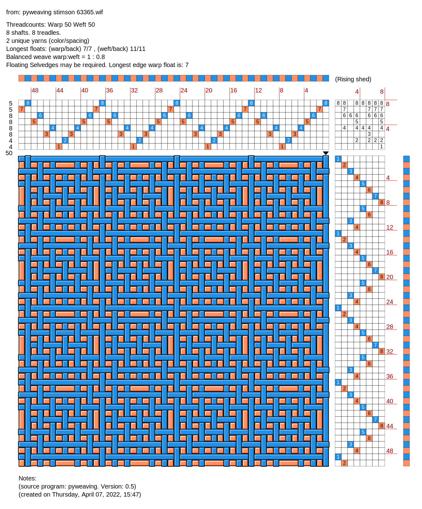

Python Weaving Tools
====================

Author: `Scott Torborg <http://www.scotttorborg.com>`_

The goal of **pyweaving** is to provide functionality for three types of usage.

* Process - Basic functionality supporting weaving a draft, 
* Visualisation - Show the information in the file in useful ways,
* Complex - Perform complex operations. E.g. convert to doubleweave, find skeleton tieups.

pyweaving is a commandline tool. See the **Command Line Usage** section for examples.

**Process:**

* Parse and write WIF files from as many sources as possible.
* Write wif files as concisely as possible.
* Calculate resource utilization (in the form of thread/yarn by color or type).
* Enable direct weaving by stepping through a draft one line at a time:

  * Showing picks, treadles, liftplan.
  * Allow resuming at a later time without loss of place.

**Visualisation:**

* Render weave drafts to bitmap images such as PNG.
* Render weave drafts to SVG (a resolution independent vector format) suitable for print publication.
* Show a variety of styles and allow user modification/definition of the styles.
* Support rendering drafts with Spacing to indicate purpose or visual effect.

  * E.g. thin structural yarns in alternate weft threads

**Complex:**

* Generate a draft from scratch based on some parameters. For example:

  * Twills like "2/2", or "2/1 1/2 1/3S",
  * Tartans by name or by sett using the Scottish Tartans Registry format,
  * Drawdown Image used to create the optimised straight draw version of that weave,
  * Pictorial image turned into a draft representing that image in weaving.
  
* Interchange with a JSON-based representation of the draft for use in client-side web apps.

Right now, it provides the above basic functionality. Below is an example in two styles:

Draft by Nathaniel Stimson, from `HandWeaving.net <http://www.handweaving.net/PatternDisplay.aspx?PATTERNID=63365>`_.

A shaded style with numbers and color for warp and weft (PNG):

A minimal unshaded style (PNG):

And in resolution independent vector form (SVG):

Future
======

Planned features include:

* Various Yarn calculations.
* Presentation in various layouts. E.g. American, Swedish and all variants of warp and tieup ordering.
* Simplify drafts by:

  * Reducing the number of harnesses or treadles to the bare minimum required to produce the same weave,
  * Reducing the number of treadles active at any given time,
  * Skeleteon tieup reductions using a variant of Tim's treadle reducer.
  
* Displaying liftplan, and various tieups at the same time.
* Satin generator.
* Language for describing threading enabling easy experimentation and editing.
* Detection of various complex weave structures. E.g. turned taquette, double weave, overshot, etc
* Display of each unique section of a large draft.
* Render ``as fabric`` with (say) double weave structures only showing the foreground threads.
* Include visualisation options based on David Raup's Laceweave.
* Entry of specific yarn details such as YPP for better ``asfabric`` rendering options.
* Rendering in color at various scales to preview color effects from various thread densities and colors.
* A loom file as a target for shaft conversion, treadling order preferences, and tieup preferences.
* Simple window based user interface for some manipulations so command line use is not mandatory.

Contents
========

.. toctree::
    :maxdepth: 2

    quickstart
    cmd
    tutorial
    api
    contributing

.. seealso::

    `What's WIF Got to Do With It? <https://www.weavezine.com/content/whats-wif-got-do-it.html>`_
        A brief overview of the history and purpose of WIF.

    `The WIF Specification <http://www.mhsoft.com/wif/wif1-1.txt>`_
        The canonical WIF 1.1 specification, published April 1997.

Indices and Tables
==================

* :ref:`genindex`
* :ref:`modindex`
