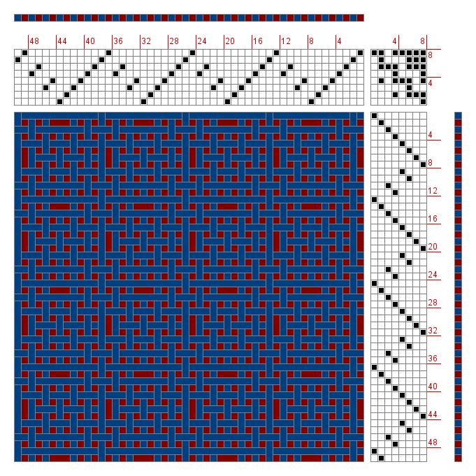

Python Weaving Tools
====================

Author: `Scott Torborg <http://www.scotttorborg.com>`_

The goal of ``pyweaving`` is to provide functionality to:

* Parse and write WIF files, with an object-based interface
* Render weave drafts to images
* Render weave drafts to PDF or SVG
* Calculate resource utilization of a pattern (in the form of thread/yarn by color or type)
* Simplify drafts (reduce the number of harnesses or treadles to the bare minimum that are required to produce the same weave, or reduce the number of treadles active at any given time)
* Check a WIF file for validity
* Generate a draft from scratch based on some parameters: for example, simple twills or double weaves
* Interchange with a JSON-based representation of the draft for use in client-side web apps.
* Support rendering drafts with a representation of variable-thickness threads/yarns. E.g. if a given weft thread is narrower than others, that pick should be shorter (fewer pixels tall) than others.

Right now, it provides basic functionality for parsing a WIF file to render a draft. Here's an example:

Draft by Nathaniel Stimson, from `HandWeaving.net <http://www.handweaving.net/PatternDisplay.aspx?PATTERNID=63365>`_.

Contents
========

.. toctree::
    :maxdepth: 2

    quickstart
    cmd
    tutorial
    api
    contributing

.. seealso::

    `What's WIF Got to Do With It? <http://www.weavezine.com/content/whats-wif-got-do-it>`_
        A brief overview of the history and purpose of WIF.

    `The WIF Specification <http://www.mhsoft.com/wif/wif1-1.txt>`_
        The canonical WIF 1.1 specification, published April 1997.

Indices and Tables
==================

* :ref:`genindex`
* :ref:`modindex`
